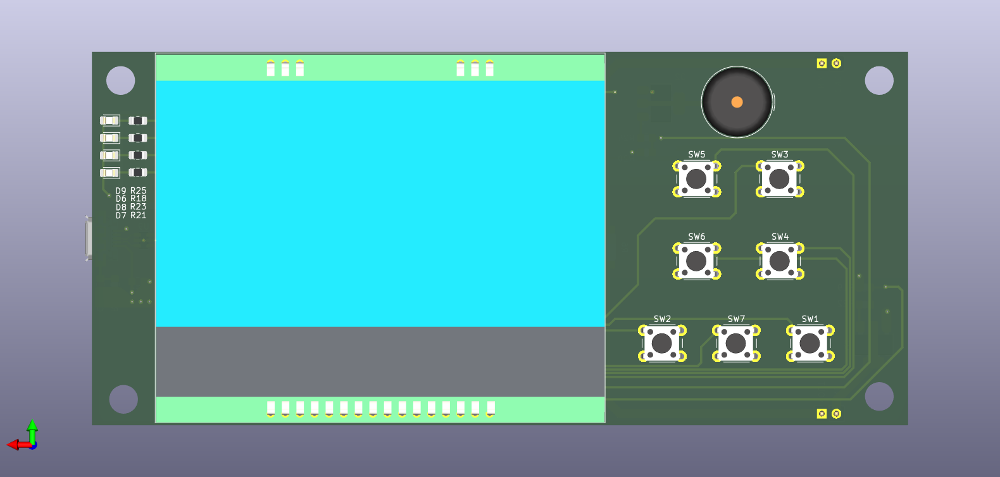

### PROJECT UNDER DEVELOPMENT

Check the schematic in the documetation folder to have an idea of the purpose of this project.

The PCB was developed in KiCAD. You can get them in the PCB-Files folder

I am currently developing the firmware. Find the current status of the firmware [here](https://github.com/users/gpcm00/projects/2)

## BOARD

